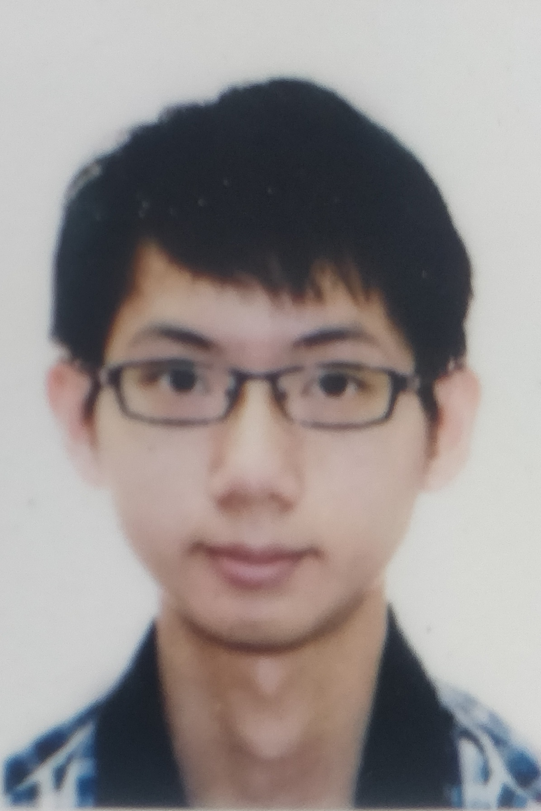

 
We are a team based in the [School of Computing, National University of Singapore](http://www.comp.nus.edu.sg).

You can reach us at the email `seer[at]comp.nus.edu.sg`

## Project team

### John Doe

[[homepage](http://www.comp.nus.edu.sg/~damithch)]
[[github](https://github.com/johndoe)]
[[portfolio](team/johndoe.md)]

* Role: Project Advisor

### Toh Hai Jie Joey

[[github](http://github.com/JoeyToh)]

* Role: Developer
* Responsibilities: Documentation

### Yap Jie Xiang

[[github](https://github.com/akgrenSoar)]

* Role: Developer
* Responsibilities: Testing

### Kyi Nuu Khin Khin

[[github](http://github.com/khinkhinn)]

* Role: Developer
* Responsibilities: Deliverables & Scheduling + Threading

### James Doe

[[github](http://github.com/johndoe)]
[[portfolio](team/johndoe.md)]

* Role: Developer
* Responsibilities: UI
