# **Projact** - Developer Guide

Projact is a **project and contact management app that helps NUS computing students to organise their fellow computing students' contacts and their teams' meeting links and tasks**.

This developer guide provides information that helps you to get started as a contributor to Projact.

## **Table of Contents**
* [Setting up](#setting-up-getting-started)
* [Design](#design)
    * [Architecture](#architecture)
    * [UI component](#ui-component)
    * [Logic component](#logic-component)
    * [Model component](#model-component)
    * [Storage component](#storage-component)
    * [Common classes](#common-classes)
* [Implementation](#implementation)
    * [Contact Features](#contact-features)
    * [Tag Features](#tag-features)
    * [Link Features](#link-features)
    * [Task Features](#task-features)
* [Documentation, logging, testing, configuration, dev-ops](#documentation-logging-testing-configuration-dev-ops)
* [Appendix](#appendix)
    * [A: Product Scope](#a-product-scope)
    * [B: User Stories](#b-user-stories)
    * [C: Use Cases](#c-use-cases)
    * [D: Non-Functional Requirements](#d-non-functional-requirements)
    * [E: Glossary](#e-glossary)
    * [F: Instructions for Manual Testing](#f-instructions-for-manual-testing)
        * [Launch and Shut Down](#launch-and-shutdown)
        * [Contact Commands](#contact-commands)
            * [Adds a person](#adds-a-person)
            * [Edits a person](#edits-a-person)
            * [Deletes a person](#deletes-a-person)
            * [Finds a person](#finds-a-person)
        * [Tag Commands](#tag-commands)
        * [Link Commands](#link-commands)
            * [Adds a link](#adds-a-link)
            * [Deletes a link](#deletes-a-link)
        * [Task Commands](#task-commands)
            * [Adds a task](#adds-a-task)
            * [Marks a task as done](#marks-a-task-as-done)
            * [Deletes a task](#deletes-a-task)
            * [Clears completed tasks](#clears-completed-tasks)
        * [Saves data](#saves-data)

--------------------------------------------------------------------------------------------------------------------

## **Setting up, getting started**

Refer to the guide [_Setting up and getting started_](SettingUp.md).

--------------------------------------------------------------------------------------------------------------------

## **Design**

### Architecture

The ***Architecture Diagram*** given above explains the high-level design of the App. Given below is a quick overview of each component.

:bulb: **Tip:** The `.puml` files used to create diagrams in this document can be found in the [diagrams](https://github.com/AY2021S1-CS2103T-T17-4/tp/blob/master/docs/diagrams/) folder. Refer to the [_PlantUML Tutorial_ at se-edu/guides](https://se-education.org/guides/tutorials/plantUml.html) to learn how to create and edit diagrams.

**`Main`** has two classes called [`Main`](https://github.com/AY2021S1-CS2103T-T17-4/tp/blob/master/src/main/java/seedu/address/Main.java) and [`MainApp`](https://github.com/AY2021S1-CS2103T-T17-4/tp/blob/master/src/main/java/seedu/address/MainApp.java). It is responsible for,
* At app launch: Initializes the components in the correct sequence, and connects them up with each other.
* At shut down: Shuts down the components and invokes cleanup methods where necessary.

[**`Commons`**](#common-classes) represents a collection of classes used by multiple other components.

The rest of the App consists of four components.

* [**`UI`**](#ui-component): The UI of the App.
* [**`Logic`**](#logic-component): The command executor.
* [**`Model`**](#model-component): Holds the data of the App in memory.
* [**`Storage`**](#storage-component): Reads data from, and writes data to, the hard disk.

Each of the four components,

* defines its *API* in an `interface` with the same name as the Component.
* exposes its functionality using a concrete `{Component Name}Manager` class (which implements the corresponding API `interface` mentioned in the previous point.

For example, the `Logic` component (see the class diagram given below) defines its API in the `Logic.java` interface and exposes its functionality using the `LogicManager.java` class which implements the `Logic` interface.

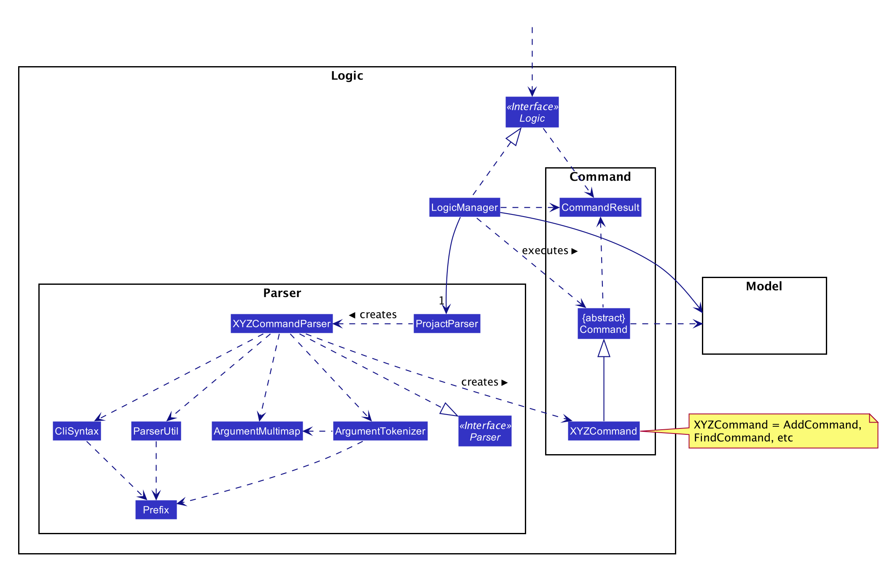

**How the architecture components interact with each other**

The *Sequence Diagram* below shows how the components interact with each other for the scenario where the user issues the command `delete 1`.

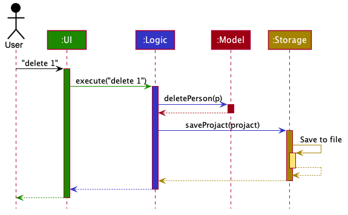

The sections below give more details of each component.

### UI component

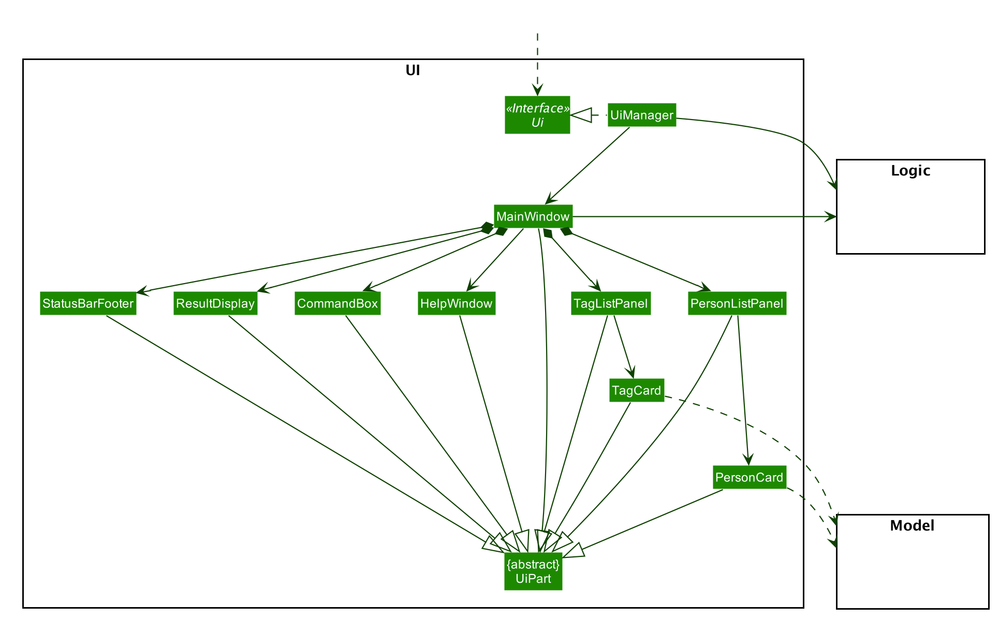

**API** :
[`Ui.java`](https://github.com/AY2021S1-CS2103T-T17-4/tp/blob/master/src/main/java/seedu/address/ui/Ui.java)

The UI consists of a `MainWindow` that is made up of parts e.g.`CommandBox`, `ResultDisplay`, `PersonListPanel`, `StatusBarFooter` etc. All these, including the `MainWindow`, inherit from the abstract `UiPart` class.

The `UI` component uses JavaFx UI framework. The layout of these UI parts are defined in matching `.fxml` files that are in the `src/main/resources/view` folder. For example, the layout of the [`MainWindow`](https://github.com/se-edu/addressbook-level3/tree/master/src/main/java/seedu/address/ui/MainWindow.java) is specified in [`MainWindow.fxml`](https://github.com/se-edu/addressbook-level3/tree/master/src/main/resources/view/MainWindow.fxml)

The `UI` component,

* Executes user commands using the `Logic` component.
* Listens for changes to `Model` data so that the UI can be updated with the modified data.

### Logic component

**API** :
[`Logic.java`](https://github.com/AY2021S1-CS2103T-T17-4/tp/blob/master/src/main/java/seedu/address/logic/Logic.java)

1. `Logic` uses the `ProjactParser` class to parse the user command.
1. This results in a `Command` object which is executed by the `LogicManager`.
1. The command execution can affect the `Model` (e.g. adding a person).
1. The result of the command execution is encapsulated as a `CommandResult` object which is passed back to the `Ui`.
1. In addition, the `CommandResult` object can also instruct the `Ui` to perform certain actions, such as displaying help to the user.

Given below is the Sequence Diagram for interactions within the `Logic` component for the `execute("delete 1")` API call.

:information_source: **Note:** The lifeline for `DeleteCommandParser` should end at the destroy marker (X) but due to a limitation of PlantUML, the lifeline reaches the end of diagram.

### Model component

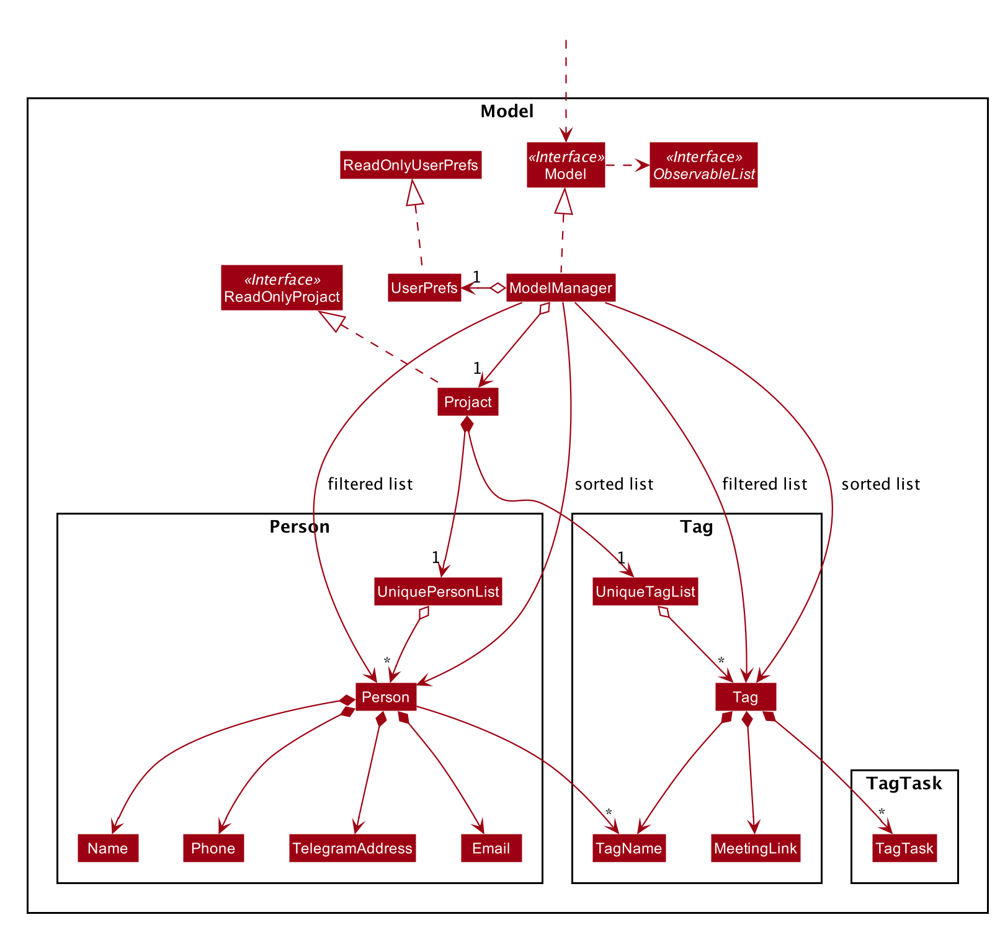

**API** : [`Model.java`](https://github.com/AY2021S1-CS2103T-T17-4/tp/blob/master/src/main/java/seedu/address/model/Model.java)

The `Model`,

* stores a `UserPref` object that represents the user’s preferences.
* stores the projact data.
* exposes unmodifiable `ObservableList<Person>` and `ObservableList<Tag>` that can be 'observed' e.g. the UI can be bound to this list so that the UI automatically updates when the data in the list change.
* does not depend on any of the other three components.

:information_source: **Note:** An alternative (arguably, a more OOP) model is given below. It has a `Tag` list in the `Projact`, and its `TagName` is referenced by `Person`. This allows `Projact` to only require one `Tag` object per unique `Tag`, instead of each `Person` needing their own `Tag` object. 
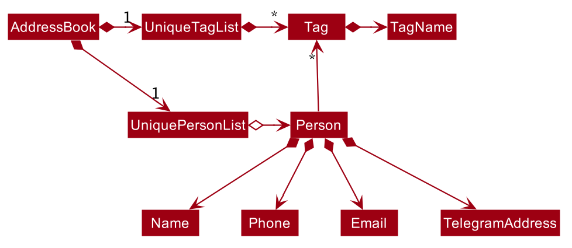

### Storage component

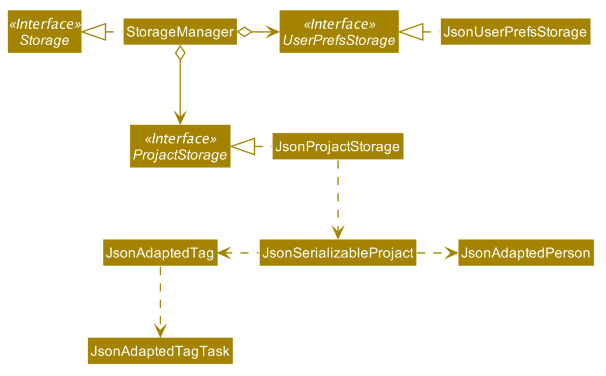

**API** : [`Storage.java`](https://github.com/AY2021S1-CS2103T-T17-4/tp/blob/master/src/main/java/seedu/address/storage/Storage.java)

The `Storage` component,
* can save `UserPref` objects in json format and read it back.
* can save projact data in json format and read it back.

### Common classes

Classes used by multiple components are in the `seedu.addressbook.commons` package.

--------------------------------------------------------------------------------------------------------------------
## **Implementation**

### Contact features

**Sort command**

The `sort` command allows a user to sort the current person list in alphanumerical order. 

- How is SortContactCommand executed
    1. The command is passed into `LogicManager`
    1. `LogicManager` calls parseCommand method of `ProjactParser`.
    1. `ProjactParser` identifies and returns `SortCommand`.
    1. `LogicManager` executes `SortCommand`, which updates the sorted person list by comparing the personNames using `PersonNameComparator` in `Model`.

The diagram below shows a sample interaction of SortCommand.

- Why is it implemented that way?
    - The overall implementation flow of the `sort` command is similar to the `find` command in the original AB3 but instead of using Filtered
     List and Predicate, Sorted List and Comparator are used to sort the list.

### Tag features

**TagAdd command**

The `tagadd` command allows a user to add a new tag to the tag list. The tag added will not have any contacts under it initially.

- How is TagAddCommand executed
    1. The command is passed into `LogicManager`.
    2. `LogicManager` calls the parseCommand method of `ProjactParser`.
    3. `ProjactParser` identifies the commandWord, which in this case is 'tagadd' and the arguments.
    4. `ProjactParser` calls the parse method of `TagAddCommandParser`, which parses the argument, creates a new `Tag` object, and returns a new `TagAddCommand` with the new `Tag` object used as an argument.
    5. The `LogicManager` then calls the execute method of the `TagAddCommand`, which calls the addTag method of `Model`.

The diagram below shows a sample interaction of `TagAddCommand`. 

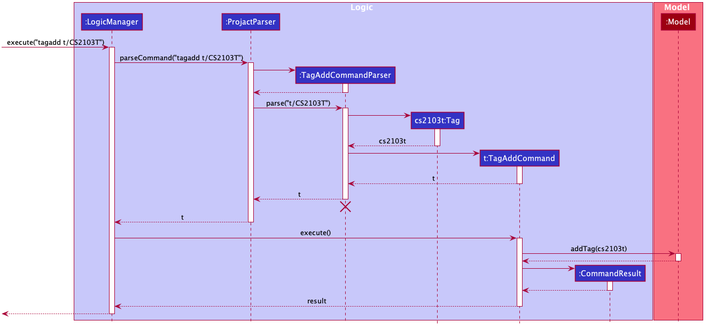

- Why is it implemented that way:
    - The command is implemented to be as similar as possible to the current command classes, so that there will be minimal changes to the overall design of the product. Most new classes added to accommodate the TagAddCommand will also be largely similar to classes implemented in AB3.

**TagEdit command**

The `tagedit` command allows a user to edit the tag name of a tag in the list.

- How is TagEditCommand executed
    1. The command is passed in to `LogicManager`.
    2. `LogicManager` calls the parseCommand method of `ProjactParser`.
    3. `ProjactParser` identifies the commandWord, which in this case is 'tagedit' and the arguments.
    4. `ProjactParser` calls the parse method of `TagEditCommandParser`, which parses the argument, creates a new `Index` object and a new `EditTagDescriptor`object, and returns a new `TagEditCommand` with those objects used as arguments.
    5. The `LogicManager` then calls the execute method of the `TagEditCommand`, which create a new `Tag` object with the edited field and replaces the current `Tag` object at the specified index in `FilteredTagList`.
    6. `FilteredTagList` is updated with the edited `Tag` object and will reflect the changes in the `Model`.

The diagram below shows a sample interaction of `TagEditCommand`.

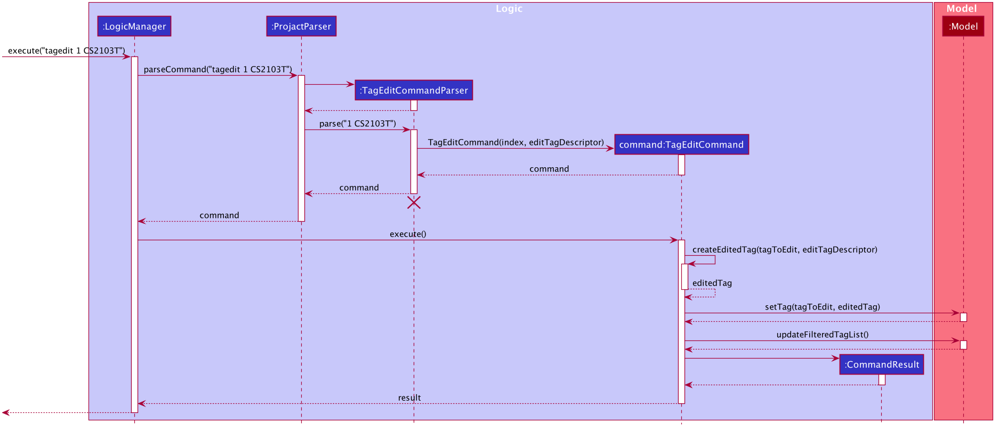
  
- Why is it implemented that way:
  - The implementation of the TagEdit command is very similar to the Edit command so that we can reuse the previous code.
  - For example, by making the commandWord 'tagedit' instead of 'tag edit', we are able to make use of `ProjectParser` instead of creating a different parser just to identify tag commands.
  
**TagList command**

The `taglist` command allows a user to display all the tags in the tag list currently.

- How is TagListCommand executed
    1. The command is passed into `LogicManager`.
    1. `LogicManager` calls parseCommand method of `ProjactParser`.
    1. `ProjactParser` identifies and returns `TagListCommand`.
    1. `LogicManager` executes `TagListCommand`, which sets isTagList parameter in `CommandResult` to true.
    1. `MainWindow` detects `CommandResult` isTagList() returns true and hence invokes the showTagList() method.
    
The diagram below shows a sample interaction of `TagListCommand`. 

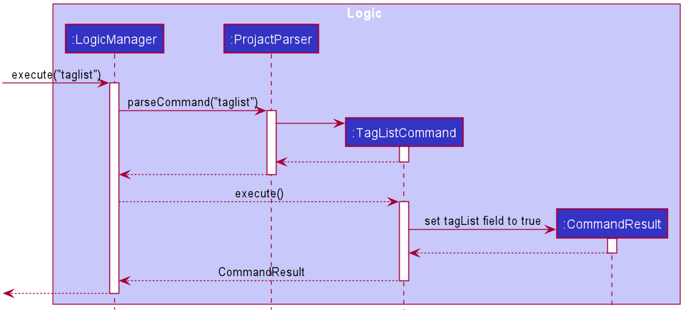

- Why is it implemented that way:
    - The command is implemented to be as similar as possible to the current command classes, so that there will be minimal changes to the overall design of the product. Most new classes added to accommodate the `TagListCommand` will also be largely similar to classes implemented in AB3.

**TagFind command**

The `tagfind` command allows a user to display all tags which contains at least one of the specified keywords.

- How is TagFindCommand executed
    1. The command is passed in to `LogicManager`.
    2. `LogicManager` calls the parseCommand method of `ProjactParser`.
    3. `ProjactParser` identifies the commandWord, which in this case is 'tagfind' and the arguments.
    4. `ProjactParser` calls the parse method of `TagFindCommandParser`, which parses the argument, creates a new `TagNameContainsKeywordsPredicate` object with the keywords, and returns a new `TagFindCommand` with the new `TagNameContainsKeywordsPredicate` object used as an argument.
    5. The `LogicManager` then calls the execute method of the `TagFindCommand`, which calls the updateFilteredTagList method of `Model`. This method takes in a `Predicate<Tag>` and filters the `TagList` by the supplied predicate.

The diagram below shows a sample interaction of `TagFindCommand`. 

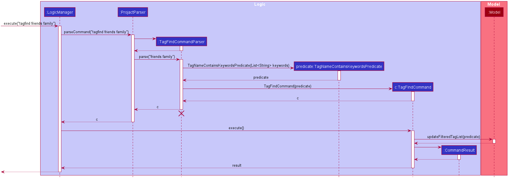

- Why is it implemented that way:
    - The command is implemented to be as similar as possible to the current command classes, so that there will be minimal changes to the overall design of the product. Most new classes added to accommodate the `TagFindCommand` will also be largely similar to classes implemented in AB3.

**TagSort command**

The `tagsort` command allows a user to sort the tag list in alphanumerical order. 

The implementation and interaction of the `TagSortCommand` is similar to `SortContactCommand` but it uses `TagNameComaparator` instead of `PersonNameComparator`.

- Why is it implemented that way:
    - The TagSort and SortContact commands share similar functions with the former sorting the tag list and the latter sorting the person list. Hence, a similar set of methods are for this feature to ensure the application can work smoothly.
    
**TagDelete command**

The `tagdelete` command allows a user to delete a tag permanently. This feature will result in the removal of the tag from the tag list and from any contact with said tag.

- How is TagDeleteCommand executed
    1. The command is passed in to `LogicManager`.
    2. `LogicManager` calls the parseCommand method of `ProjactParser`.
    3. `ProjactParser` identifies the commandWord, which in this case is 'tagdelete' and the arguments.
    4. `ProjactParser` calls the parse method of `TagDeleteCommandParser`, which parses the argument, creates a new `Index` object with the parsed user input, and returns a new `TagDeleteCommand` with the new `Index` object used as an argument.
    5. The `LogicManager` then calls the execute method of the `TagDeleteCommand`, which retrieves the most updated tag list from the `ModelManager`. From this list, the tag to be deleted is retrieved by its index. Then, the `ModelManager` will go on to remove all instances of the tag.

The diagram below shows a sample interaction of `TagDeleteCommand`.

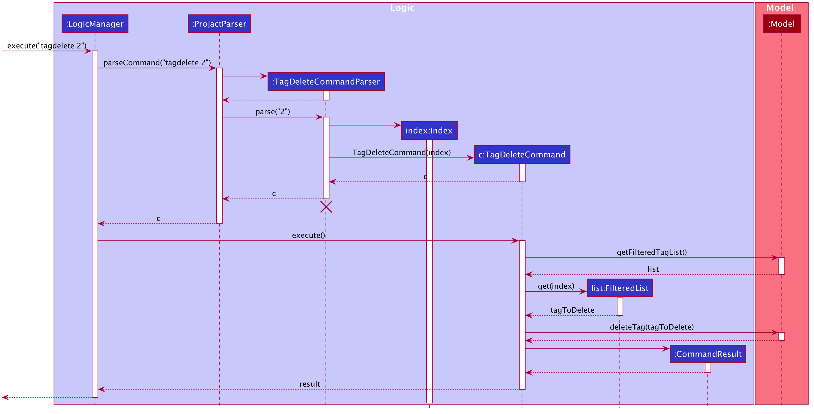
 
- Why is it implemented that way:
    - The command is implemented to be as similar as possible to the current command classes, so that there will be minimal changes to the overall design of the product. Most new classes added to accommodate the `TagDeleteCommand` will also be largely similar to classes implemented in AB3.

### Link Features 
   
**LinkAdd command**

The `linkadd` command allows a user to add a meeting link to a specified tag.

- How is LinkAddCommand executed
    1. The command is passed into `LogicManager`.
    2. `LogicManager` calls the parseCommand method of `ProjactParser`.
    3. `ProjactParser` identifies the commandWord, which in this case is 'linkadd' and the arguments.
    4. `ProjactParser` calls the parse method of `LinkAddCommandParser`, which parses the argument, creates new `Optional<MeetingLink>` and `Index` objects, and returns a new `LinkAddCommand` with the new `Optional<MeetingLink>` and `Index` objects used as arguments.
    5. The `LogicManager` then calls the execute method of the `LinkAddCommand`, which creates a new `Tag` object with the `Optional<MeetingLink>` object, and replaces the current `Tag` object at the specified index in `FilteredTagList`.
    6. `FilteredTagList` is updated with the edited `Tag` object and will reflect the changes in the `Model`.

The diagram below shows a sample interaction of `LinkAddCommand`. 

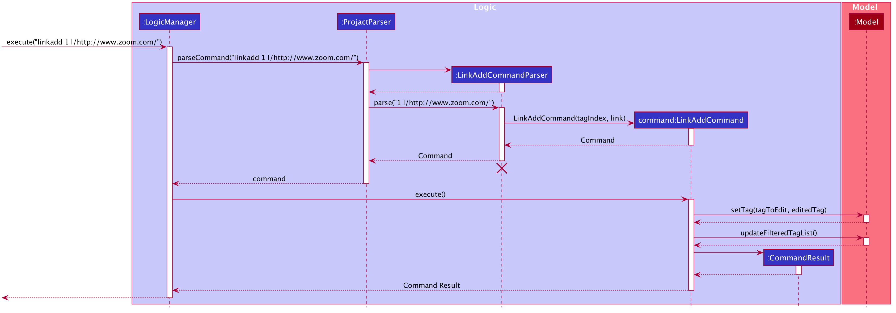  

- Why is it implemented this way:
    - The command is implemented to be as similar as possible to the current command classes, so that there will be minimal changes to the overall design of the product. Most new classes added to accommodate the `LinkAddCommand` will also be largely similar to classes implemented in AB3.

**LinkDelete command**
 
The `linkdelete` command allows a user to delete the meeting link from a tag permanently. 
 
- How is LinkDeleteCommand executed:
    1. The command is passed in to `LogicManager`.
    1. `LogicManager` calls the parseCommand method of `ProjactParser`.
    1. `ProjactParser` identifies the command word, which in this case is 'linkdelete' and the arguments.
    1. `ProjactParser` calls the parse method of `LinkDeleteCommandParser`, which parses the argument, creates a new `Index` object with the parsed user input, and returns a new `LinkDeleteCommand` with the new `Index` object used as an argument.
    1. The `LogicManager` then calls the execute method of the `LinkDeleteCommand`, which retrieves the most updated tag list from the `ModelManager`. 
    From this list, the tag that will has its meeting link being removed will be retrieved. A new tag will be created with an empty meeting link using Optional class and replaced the old tag retrieved. 
    1. Then, the `ModelManager` will update the tag list.
    
The diagram below shows a sample interaction of `LinkDeleteCommand`. 
    
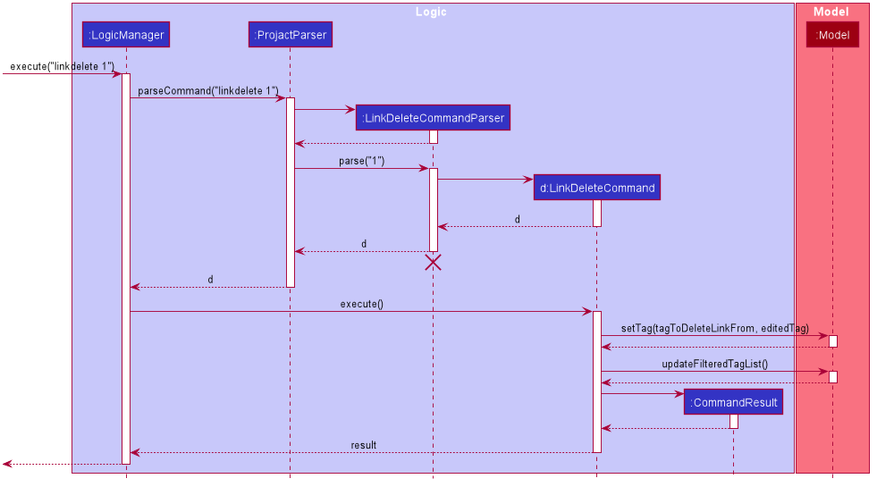  

- Why is it implemented that way:
    - The command is implemented to be as similar as possible to the current command classes, so that there will be minimal changes to the overall design of the product. Most new classes added to accommodate the `LinkDeleteCommand` will also be largely similar to classes implemented in AB3.

### Task Features 
     
**TaskAdd command**
 
The `taskadd` command allows the user to add a task to a tag. 

- How is TaskAddCommand executed:
    1. The command is passed into `LogicManager`.
    2. `LogicManager` calls the parseCommand method of `ProjactParser`.
    3. `ProjactParser` identifies the commandWord, which in this case is 'taskadd' and the arguments.
    4. `ProjactParser` calls the parse method of `TaskAddCommandParser`, which parses the argument, creates a new `editTagDescriptor` object, and returns a new `TaskAddCommand` with the new `editTagDescriptor` object used as an argument.
    5. The `LogicManager` then calls the execute method of the `TaskAddCommand`, which calls the setTag method of `Model`.

The diagram below shows a sample interaction of `TaskAddCommand`. 

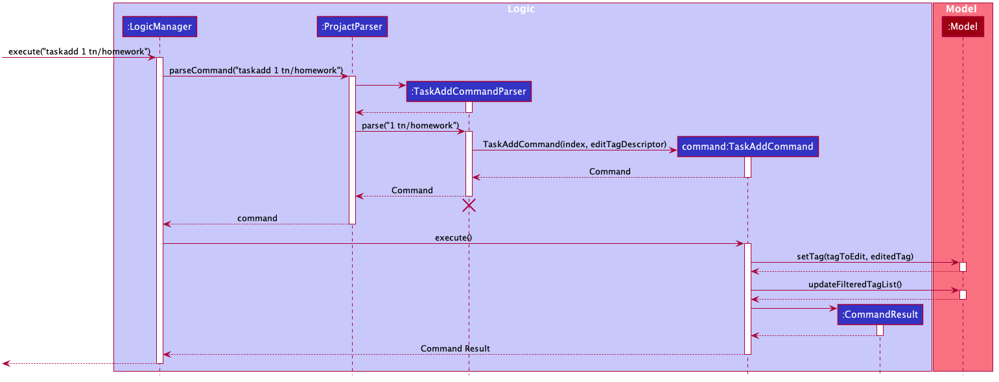

- Why is it implemented that way:
    - The command is implemented to be as similar as possible to the current command classes, so that there will be minimal changes to the overall design of the product. Most new classes added to accommodate the `TaskAddCommand` will also be largely similar to classes implemented in AB3.

**TaskDone command**
 
The `taskdone` command allows the user to mark a task under a tag as done. 
 
- How is TaskDoneCommand executed:
    1. The command is passed in to `LogicManager`.
    1. `LogicManager` calls the parseCommand method of `ProjactParser`.
    1. `ProjactParser` identifies the command word, which in this case is 'taskdone' and the arguments.
    1. `ProjactParser` calls the parse method of `TaskDoneCommandParser`, which parses the arguments, creates two `Index` objects, the first one to be 
     the tag Index and the second one is the task Index and returns a new `TaskDoneCommand` with two `Index` objects pass in as parameters.
    1. The `LogicManager` then calls the execute method of the `TaskDoneCommand`, which retrieves the tag from the taglist based on the tag Index. From
    the tag, the task list will be retrieved to get the targeted task using the task Index. The targeted task will be marked done and a new tag with
    the modified task list will be created and replaced the old Tag. 
    1. Then, the `ModelManager` will update the tag list.
    
The diagram below shows a sample interaction of `TaskDoneCommand`. 

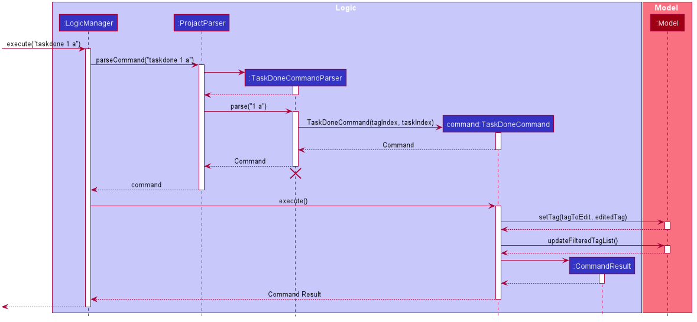   

- Why is it implemented that way:
    - The command is implemented such that there is no need for any prefixes. This helps to shorten the command and reduces the time required to mark a task as done.
    - The second index uses an alphabetical index instead of a numerical one. This avoids confusion between the index of the tag and the index of the task.
 

**TaskDelete command**
 
The `taskdelete` command allows the user to delete a task from a tag. 

- How is TaskDeleteCommand executed:
    1. The command is passed into `LogicManager`.
    2. `LogicManager` calls the parseCommand method of `ProjactParser`.
    3. `ProjactParser` identifies the commandWord, which in this case is `taskdone` and the arguments.
    4. `ProjactParser` calls the parse method of `TaskDeleteCommandParser`, which parses the argument, cand returns a new `TaskDeleteCommand`.
    5. The `LogicManager` then calls the execute method of the `TaskDeleteCommand`, which calls the setTag method of `Model`.

- Why is it implemented that way:
    - The design consideration on the indices for the `TaskDeleteCommand` is similar to `TaskDoneCommand`.

The diagram below shows a sample interaction of `TaskDeleteCommand`. 

**TaskClear command**

The `taskclear` command allows the user to clear all completed tasks under a tag.

- How is TaskClearCommand executed:
    1. The command is passed in to `LogicManager`.
    2. `LogicManager` calls the parseCommand method of `ProjactParser`.
    3. `ProjactParser` identifies the command word, which in this case is 'taskclear' and the arguments.
    4. `ProjactParser` calls the parse method of `TaskClearCommandParser`, which parses the argument, creates a new `Index` object and returns a new `TaskClearCommand` with the new `Index` object as an argument.
    5. The `LogicManager` then calls the execute method of the `TaskClearCommand`, which retrieves the `Tag` object at the specified index in `FilteredTagList`.  From the `Tag`, a list of its uncompleted tasks, `List<TagTask>`, is obtained.
    6.  A new `Tag` object is created with the new `List<TagTask>` and replaces the current `Tag` object at the specified index in `FilteredTagList`.
    7. `FilteredTagList` is then updated to reflect the changes in `Model`.
    
The diagram below shows a sample interaction of `TaskDoneCommand`. 

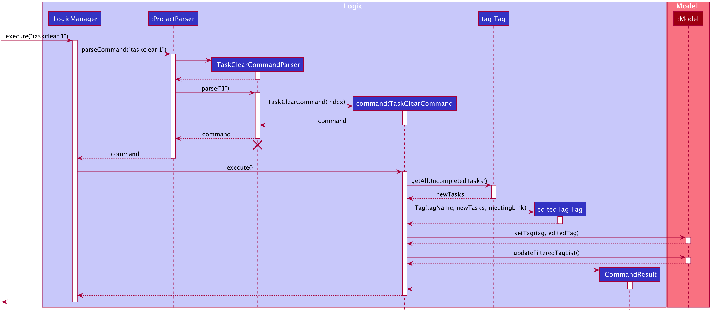    

- Why is it implemented that way:
    - The command is implemented to be similar to the current command classes, so that there will be minimal changes to the overall design of the product.
    - An alternative implementation would be for `TaskClearCommand` to not take in an index and just delete all completed tasks from every tag. 
        - However, the user may want to keep certain tags with completed tasks for tracking purposes. 
        - Furthermore, this implementation will result in a significantly long execution time for the `TaskClearCommand` as the number of tags and tasks increase. 
    
--------------------------------------------------------------------------------------------------------------------
## **Documentation, logging, testing, configuration, dev-ops**

* [Documentation guide](Documentation.md)
* [Logging guide](Logging.md)
* [Testing guide](Testing.md)
* [Configuration guide](Configuration.md)
* [DevOps guide](DevOps.md)

--------------------------------------------------------------------------------------------------------------------

## **Appendix**
### **A: Product Scope**

**Target user profile**: Computing Student

* has a need to manage a significant number of computing student contacts
* prefer desktop apps over other types
* can type fast
* is reasonably comfortable using CLI apps
* wants to group contacts based on the different modules
* has a need to store different url links for each module in a single accessible location
* wants to keep track of tasks

**Value propositions**:

* Manages contacts faster than a typical mouse/GUI driven app.
* Sorts contacts based on the different modules.
* Allows convenient search for project mates / friends taking the same module.
* Allows convenient search for the link for team meeting.
* Has a to-do list to keep track of task progress.

--------------------------------------------------------------------------------------------------------------------
### **B: User Stories**

Priorities: High (must have) - `* * *`, Medium (nice to have) - `* *`, Low (unlikely to have) - `*`

| Priority | As a …​                                    | I want to …​                               | So that I can…​                                                     |
| -------- | ------------------------------------------ | ------------------------------------------------ | ---------------------------------------------------------------------- |
| `* * *`  | new user                                   | see usage instructions                           | refer to instructions when I forget how to use the application.        |
| `* * *`  | new user                                   | see sample contacts and tags                     | have a brief idea on what the app will look like when it is being used |
| `* * *`  | user                                       | add a new contact                                |                                                                        |
| `* * *`  | user                                       | delete a contact                                 | remove contacts that I no longer need                                  |
| `* * *`  | user                                       | find a contact by name                           | locate details of persons without having to go through the entire list |
| `* * *`  | user                                       | save a telegram handle to its respective contact | find the telegram chat with that person quickly                        |
| `* * *`  | user                                       | create a tag                                     | find or sort the contacts based on tags later on.                      |
| `* * *`  | user                                       | delete a tag                                     | remove tags that are accidentally added or no longer required          |
| `* * *`  | user                                       | find a tag by name                               | locate details of the tag without having to go through the entire list |
| `* * *`  | user                                       | list all tags                                    | quickly browse through all the tags that I have added                  |
| `* * *`  | student                        	        | add tasks for each tag                           | remind myself of all the tasks that are under those tags.              |
| `* * *`  | student                        	        | delete tasks for each tag                        | remove the tasks that are no longer required for that module           |
| `* * *`  | student with many project groups	        | add the meeting platform links to each tag       | conveniently contact the team or initiate a team meeting               |
| `* * *`  | student with many project groups	        | delete the meeting platform link for each tag    | remove the link if it has been added wrongly                           |
| `* *`    | student                        	        | clear all completed tasks under each tag         | remove the tasks that are no longer required                           |
| `* *`    | user                                       | update a tag (name)                              | correct the misspelled tag name                                        |
| `* *`    | user                                       | sort the tags by its tag name                    | view tags in alphabetical order                                        |
| `* *`    | user with many contacts                    | sort the contacts by name                        | view contacts in alphabetical order                                    |
| `* *`    | student                        	        | mark the status of a particular task as done     | keep track of the different task progress under that tag.              |
| `* *`    | student with many project groups	        | add remarks on the tag                           | find module-related information from the tag                           |
| `* *`    | student with many project groups	        | delete the comments on the tag                   |                                                                        |
| `*`      | long-time user	                            | archive old tags 	                               | keep my contacts up to date                                            |
| `*`      | long-time user	                            | unarchive old tags	                           | conveniently use the same old tag containing the same contact          |
| `*`      | power user	                                | create shortcuts for existing commands           | type faster in my preferred way for certain commands                   |
| `*`      | power user	                                | import and export person list to another device  | save time compiling the person list                                    |

--------------------------------------------------------------------------------------------------------------------
### **C: Use Cases**

(For all use cases below, the **System** is the `Projact` and the **Actor** is the `user`, unless specified otherwise)

#### **Use case: UC01 - Delete a person**

**MSS**

1.  User requests to list persons
2.  Projact shows a list of persons
3.  User requests to delete a specific person in the list
4.  Projact deletes the person

    Use case ends.

**Extensions**

* 2a. The list containing all the persons is empty.

  Use case ends.

* 3a. The given index is invalid.

    * 3a1. Projact shows an error message.

      Use case resumes at step 2.

#### **Use case: UC02 - List all tags**

**MSS**

1. User requests to list tags
2. Projact shows a list of tags

    Use case ends.

**Extensions**

* 2a. The list containing all the tags is empty.

  Use case ends.
  
#### **Use case: UC03 - Create a Tag**

**MSS**

1.  User requests to create a tag
2.  Projact adds the tag.

    Use case ends.

**Extensions**

* 2a. The tag already exists.

    * 2a1. Projact shows an error message.

  Use case ends.

#### **Use case: UC04 - Delete a tag**

**MSS**

1.  User requests to list tags
2.  Projact shows a list of tags
3.  User requests to delete a specific tag in the list
4.  Projact deletes the tag

    Use case ends.

**Extensions**

* 2a. The list containing all the tags is empty.

  Use case ends.

* 3a. The given index is invalid.

    * 3a1. Projact shows an error message.

      Use case resumes at step 2.

#### **Use case: UC05 - Find a tag**

**MSS**

1.  User searches for tag(s) by keyword(s)
2.  Projact displays a list of matching tags

    Use case ends.

**Extensions**

* 2a. The list containing all the tags is empty.

  Use case ends.

* 2b. There are no tags that match the keyword(s)

  Use case ends.

* 2c. User did not specify any keywords.

    * 2c1. Projact shows an error message.

      Use case resumes at step 1.

#### **Use case: UC06 - Edit tag**

**MSS**

1. User requests to <u>list tags (UC02) </u>
2. User requests to edit a specific tag in the list
3. Projact edits the tag

   Use case ends.

**Extensions**

* 1a. The list containing all the tags is empty.

     Use case ends.

* 2a. The given index is invalid.

    * 2a1. Projact shows an error message.

      Use case resumes at step 2.

* 2b. The new tag name is missing.

    * 2b1. Projact shows an error message.

      Use case resumes at step 2.

#### **Use case: UC07 - Add a link to a tag**

**MSS**
1. User requests to <u>list tags (UC02) </u>
2. User requests to add a link to a tag in the list.
3. Projact adds the link to the tag.

   Use case ends.

**Extensions**
* 1a. The list containing all the tags is empty.

     Use case ends.
     
* 2a. The given index is invalid.

    * 2a1. Projact shows an error message.

      Use case resumes at step 2.

* 2b. The tag already has a link.

    * 2b1. Projact shows an error message.

      Use case resumes at step 2. 
      
* 2c. The input link is not valid.

    * 2b1. Projact shows an error message.

      Use case resumes at step 2. 

#### **Use case: UC08 - Mark a task as done**

**MSS**
1. User requests to <u>list tags (UC02) </u>
2. User requests to mark a particular task from a tag in the list as done.
3. Projact changes the status of the task to 'done'.

   Use case ends.

**Extensions**
* 1a. The list containing all the tags is empty.

     Use case ends.
     
* 2a. The given index is invalid.

    * 2a1. Projact shows an error message.

      Use case resumes at step 2.

* 2b. The targeted task has been completed.

    * 2b1. Projact shows an error message.

      Use case resumes at step 2.     
      
#### **Use case: UC09 - Clear completed tasks**

**MSS**
1. User requests to <u>list tags (UC02) </u>
2. User requests to delete all completed tasks from a tag in the list
3. Projact deletes all completed tasks from the tag
  
   Use case ends.

**Extensions**
* 1a. The list is empty.

     Use case ends.
     
* 2a. The given index is invalid.

    * 2a1. Projact shows an error message.

      Use case resumes at step 2.

* 2b. The tag has no completed tasks.

    * 2b1. Projact shows an error message.

      Use case resumes at step 2.     

--------------------------------------------------------------------------------------------------------------------
### **D: Non-Functional Requirements**

1.  Should work on any _mainstream OS_ as long as it has Java `11` or above installed.
1.  Should be able to hold up to 1000 persons without a noticeable sluggishness in performance for typical usage.
1.  A user with above average typing speed for regular English text (i.e. not code, not system admin commands) should be able to accomplish most of the tasks faster using commands than using the mouse.
1. The system should work on both 32-bit and 64-bit environments.
1. The software should work without requiring an installer.
1. The software should not depend on any of the team member’s own remote server.
1. The product should not use images that would result in copyright infringement.
1. The team should give credit for any reused code.
1. The software should not depend on any third-party frameworks/libraries that are not approved by the CS2103T teaching team.
1. The software should obey Java checkstyle rules.
1. The system should respond within two seconds.
1. The product is not required to handle the communication between the user and those in the user’s projact.
1. The product should be customised to target NUS Computing students.
1. The system should be usable by a novice who has never used a command line interface before.
1. The product should be targeting users who can type fast and prefer typing over other means of input.
1. The product should be for a single user i.e. (not a multi-user product).
1. The data should be stored locally and should be in a human editable text file.
1. The data should not be stored using a Database Management System (DBMS).
1. The data should be updated as the product is being used (update with every command).
1. The user’s data should not be accessible to anyone who does not have access to the user’s local files.
1. The user’s data should not be accessible by developers of the product.

--------------------------------------------------------------------------------------------------------------------
### **E: Glossary**

* **Contact**: A person's information, which includes the name, phone number, email address and Telegram handle of the person
* **Tag**: A label to group and/or distinguish different contacts. Examples: Relationship with person (friend, family, etc), common module taken (MA1101R, CS2101, etc)
* **Mainstream OS**: Windows, Linux, Unix, OS-X

--------------------------------------------------------------------------------------------------------------------
### **F: Instructions for manual testing**

Given below are instructions to test the app manually.

:information_source: **Note:** These instructions only provide a starting point for testers to work on;
testers are expected to do more *exploratory* testing.

#### Launch and shutdown

1. Initial launch

   1. Download the jar file and copy into an empty folder

   2. Double-click the jar file
       Expected: Shows the GUI with a set of sample contacts. The window size may not be optimum.

2. Saving window preferences

   1. Resize the window to an optimum size. Move the window to a different location. Close the window.

   2. Re-launch the app by double-clicking the jar file. 
       Expected: The most recent window size and location is retained.
       
#### Contact Commands       
#### Adds a person

1. Adding a person while all persons are being shown

    1. Prerequisites: List all persons using the `list` command. Multiple persons in the list.
    
    2. Test case: `add n/Jane p/98765432 e/jane@gmail.com ta/jane_tan t/cs2103`  
        Expected: A new contact is added to the end of the persons list with the contact details set to the respective user inputs. Contact details are shown in the status message.
    
    3. Test case: `add n/Jane p/98765432 e/jane@gmail.com`  
        Expected: No person is added. Invalid command format error shown in the status message due to missing `ta/TELEGRAM_ADDRESS` field.
    
    4. Test case: `add n/Jane p/98881999 e/janelim@gmail.com ta/jane_lim t/cs2103`  
        Expected: No person is added. Duplicate person error shown in the status message due to existing contact having the exact same name.
    
#### Edits a person

1. Editing a person while all persons are being shown

    1. Prerequisites: List all persons using the `list` command. Multiple persons in the list.
    
    2. Test case: `edit 1 n/James Lee e/jameslee@example.com`  
        Expected: Contact details of the first contact in the list is set to the respective user inputs. Updated contact details are shown in the status message.
    
    3. Test case: `edit 0 n/James Lee`  
        Expected: No person is edited. Invalid command format error shown in the status message due to non-positive index indicated.
    
    4. Test case: `edit 1`  
        Expected: No person is edited. Error message stating that there should be at least one field provided in shown in the status message.

    5. Test case: `edit x` (where x is larger than the list size) 
        Expected: No person is edited. Error message stating that index is invalid is shown in the status message.
             
#### Deletes a person

1. Deleting a person while all persons are being shown

   1. Prerequisites: List all persons using the `list` command. Multiple persons in the list.

   2. Test case: `delete 1` 
      Expected: First contact is deleted from the list. Details of the deleted contact shown in the status message.

   3. Test case: `delete 0` 
      Expected: No person is deleted. Error details shown in the status message. Status bar remains the same.

   4. Other incorrect delete commands to try: `delete`, `delete x`, `...` (where x is larger than the list size) 
      Expected: Similar to previous.
      
#### Finds a person

1. Finding a person while all persons are being shown
    
    1. Prerequisites: List all persons using the `list` command. Multiple persons in the list. For the following test cases, assume that the list contains the contacts: Jane, John, JanE.
    
    2. Test case: `find john`  
        Expected: The contact John and his contact details is listed. The number of contacts listed is shown in the status message.
        
    3. Test case: `find jane`  
        Expected: The contacts Jane and JanE are listed. The number of contacts listed is shown in the status message.
        
    4. Test case: `find james`  
        Expected: No contacts are listed. The number of contacts listed is shown in the status message.
        
    5. Test case: `find`  
        Expected: Invalid command format error is shown in the status message due to missing `KEYWORD` field.
        
#### Tag Commands

The manual testing of tag commands such as `tagadd`, `tagedit`, `tagdelete`, `tagfind` can be done in a similar to the contact commands. However, instead of using `list` to list all tags,
`taglist` should be used instead.

#### Link Commands
#### Adds a link

1. Adding a link to a tag while all tags are being shown

    1. Prerequisites: List all tags using the `taglist` command. For step 2, assume the first tag in the list has no pre-existing link.
    
    2. Test case: `linkadd 1 l/http://zoom.com/`  
        Expected: The link is added to the first tag in the tag list. The link is shown in the status message.
        
    3. Test case: `linkadd 1 l/http://google.com/`  
        Expected: No link is added. Error message stating there is already a link is shown in the status message.
    
    4. Test case: `linkadd 2`  
        Expected: No link is added. Error message stating that there should be a link is shown in the status message.
        
    5. Test case: `linkadd 2 l/http`  
        Expected: No link is added. Error message stating the correct link format is shown in the status message.
        
#### Deletes a link

1. Deleting a link from a tag while all the tags are being shown

    1. Prerequisites: List all tags using the `taglist` command. For the following test cases, assume that only the first tag has a link.
    
    2. Test case: `linkdelete 1`  
        Expected: Link is deleted from the first tag in the list. Details of deleted link is shown in the status message.
        
    3. Test case: `linkdelete 2` 
        Expected: No link is deleted. Error message stating that the tag does not have a link is shown in the status message.
        
    4. Test case: `linkdelete 0`  
        Expected: No link is deleted. Invalid command format error is shown in the status message due to non-positive index.

#### Task Commands
#### Adds a task

1. Adding a task to a tag while all tags are being shown

    1. Prerequisites: List all tags using the `taglist` command.
    
    2. Test case: `taskadd 1 task/submit reflection`  
        Expected: Task is added to the first tag in the list, with a cross beside it to indicate that the task is incomplete. Task details are shown in the status message.
        
    3. Test case: `taskadd 1`  
        Expected: No task is added. Invalid command format error shown in the status message due to missing `task/TASK_NAME` field.
        
    4. Test case: `taskadd 5 task/peer review`  
        Expected: No task is added. Error message stating that index is invalid is shown in the status message.
        
#### Marks a task as done

1. Marking a task as done while all tags are being shown

    1. Prerequisites: List all tags using the `taglist` command. For the following test cases, assume that the first tag has 1 task, while the other tags have none.
    
    2. Test case: `taskdone 1 a`  
        Expected: The first task in the first tag in the list is marked as done. Cross changes to a tick to indicate that the task is completed. Task details are shown in the status message.
        
    3. Test case: `taskdone 1 a` (repeating the same command)  
        Expected: Message stating that the task has already been completed is shown in the status message.
        
    4. Test case: `taskdone 1 b`  
        Expected: No task is marked as done. Error message stating that the task index is invalid is shown in the status message.
    
    5. Test case: `taskdone 2 a`  
        Expected: No task is marked as done. Error message stating that there are no tasks under the indicated tag is shown in the status message.

#### Deletes a task

1. Deleting a task from a tag while all the tags are being shown

    1. Prerequisites: List all tags using the `taglist` command. For the following test cases, assume that the first tag has 1 task, while the other tags have none.
    
    2. Test case: `taskdelete 1 a`  
        Expected: The first task in the first tag in the list is deleted. Details of deleted task is shown in the status message.
        
    3. Test case: `taskdelete 1 a` (repeating the same command)  
        Expected: No task is deleted. Error message stating that there are no tasks under the indicated tag is shown in the status message.
        
    4. Test case: `taskdelete 2 a`  
        Expected: No task is deleted. Error message stating that there are no tasks under the indicated tag is shown in the status message.

#### Clears completed tasks

1. Clearing the completed tasks from a tag while all the tags are being shown

    1. Prerequisites: List all tags using the `taglist` command. For the following test cases, assume that the first tag has 2 completed tasks, while the other tags have none.
    
    2. Test case: `taskclear 1`  
        Expected: All the completed tasks in the first tag in the list are deleted. Success message is shown in the status message.
        
    3. Test case: `taskclear 1` (repeating the same command)  
        Expected: Error message stating that there are no completed tasks under the indicated tag is shown in the status message.
        
    4. Test case: `taskdelete 2 a`  
        Expected: Error message stating that there are no completed tasks under the indicated tag is shown in the status message.
        
#### Saves data

1. Dealing with missing/corrupted data files

   1. If the data file is missing, the application will launch a window that is populated with the sample data. User can use the `clear` command to get an empty projact window.
      Expected: Window with sample data

   2. If the data file is corrupted, users should delete the `projact.json` file in data folder. Relaunch the jar file again.
      Expected: Window with sample data
