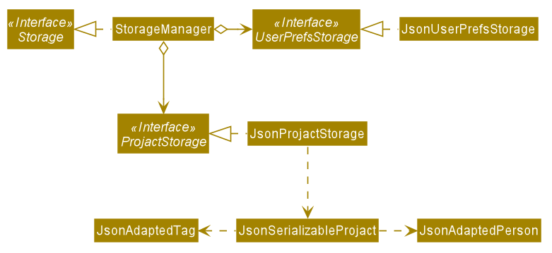

# **Projact** - Developer Guide

Projact is a **project and contact management app that helps NUS computing students to organise their fellow computing students' contacts and their teams' meeting links and tasks**.

This developer guide provides information that helps you to get started as a contributor to Projact.

## **Table of Contents**
* [Setting up](#setting-up-getting-started)
* [Design](#design)
    * [Architecture](#architecture)
    * [UI component](#ui-component)
    * [Logic component](#logic-component)
    * [Model component](#model-component)
    * [Storage component](#storage-component)
    * [Common classes](#common-classes)
* [Implementation](#implementation)
* [Known Issues](#known-issues)
* [Documentation, logging, testing, configuration, dev-ops](#documentation-logging-testing-configuration-dev-ops)
* [Appendix](#appendix)
    * [A: Product Scope](#a-product-scope)
    * [B: User Stories](#b-user-stories)
    * [C: Use Cases](#c-use-cases)
    * [D: Non-Functional Requirements](#d-non-functional-requirements)
    * [E: Glossary](#e-glossary)
    * [F: Instructions for Manual Testing](#f-instructions-for-manual-testing)
        * [Launch and Shut Down](#launch-and-shutdown)
        * [Deletes a person](#deletes-a-person)
        * [Saves data](#saves-data)

--------------------------------------------------------------------------------------------------------------------

## **Setting up, getting started**

Refer to the guide [_Setting up and getting started_](SettingUp.md).

--------------------------------------------------------------------------------------------------------------------

## **Design**

### Architecture

The ***Architecture Diagram*** given above explains the high-level design of the App. Given below is a quick overview of each component.

:bulb: **Tip:** The `.puml` files used to create diagrams in this document can be found in the [diagrams](https://github.com/se-edu/addressbook-level3/tree/master/docs/diagrams/) folder. Refer to the [_PlantUML Tutorial_ at se-edu/guides](https://se-education.org/guides/tutorials/plantUml.html) to learn how to create and edit diagrams.

**`Main`** has two classes called [`Main`](https://github.com/se-edu/addressbook-level3/tree/master/src/main/java/seedu/address/Main.java) and [`MainApp`](https://github.com/se-edu/addressbook-level3/tree/master/src/main/java/seedu/address/MainApp.java). It is responsible for,
* At app launch: Initializes the components in the correct sequence, and connects them up with each other.
* At shut down: Shuts down the components and invokes cleanup methods where necessary.

[**`Commons`**](#common-classes) represents a collection of classes used by multiple other components.

The rest of the App consists of four components.

* [**`UI`**](#ui-component): The UI of the App.
* [**`Logic`**](#logic-component): The command executor.
* [**`Model`**](#model-component): Holds the data of the App in memory.
* [**`Storage`**](#storage-component): Reads data from, and writes data to, the hard disk.

Each of the four components,

* defines its *API* in an `interface` with the same name as the Component.
* exposes its functionality using a concrete `{Component Name}Manager` class (which implements the corresponding API `interface` mentioned in the previous point.

For example, the `Logic` component (see the class diagram given below) defines its API in the `Logic.java` interface and exposes its functionality using the `LogicManager.java` class which implements the `Logic` interface.

**How the architecture components interact with each other**

The *Sequence Diagram* below shows how the components interact with each other for the scenario where the user issues the command `delete 1`.

The sections below give more details of each component.

### UI component

**API** :
[`Ui.java`](https://github.com/se-edu/addressbook-level3/tree/master/src/main/java/seedu/address/ui/Ui.java)

The UI consists of a `MainWindow` that is made up of parts e.g.`CommandBox`, `ResultDisplay`, `PersonListPanel`, `StatusBarFooter` etc. All these, including the `MainWindow`, inherit from the abstract `UiPart` class.

The `UI` component uses JavaFx UI framework. The layout of these UI parts are defined in matching `.fxml` files that are in the `src/main/resources/view` folder. For example, the layout of the [`MainWindow`](https://github.com/se-edu/addressbook-level3/tree/master/src/main/java/seedu/address/ui/MainWindow.java) is specified in [`MainWindow.fxml`](https://github.com/se-edu/addressbook-level3/tree/master/src/main/resources/view/MainWindow.fxml)

The `UI` component,

* Executes user commands using the `Logic` component.
* Listens for changes to `Model` data so that the UI can be updated with the modified data.

### Logic component

**API** :
[`Logic.java`](https://github.com/se-edu/addressbook-level3/tree/master/src/main/java/seedu/address/logic/Logic.java)

1. `Logic` uses the `ProjactParser` class to parse the user command.
1. This results in a `Command` object which is executed by the `LogicManager`.
1. The command execution can affect the `Model` (e.g. adding a person).
1. The result of the command execution is encapsulated as a `CommandResult` object which is passed back to the `Ui`.
1. In addition, the `CommandResult` object can also instruct the `Ui` to perform certain actions, such as displaying help to the user.

Given below is the Sequence Diagram for interactions within the `Logic` component for the `execute("delete 1")` API call.

:information_source: **Note:** The lifeline for `DeleteCommandParser` should end at the destroy marker (X) but due to a limitation of PlantUML, the lifeline reaches the end of diagram.

### Model component

**API** : [`Model.java`](https://github.com/se-edu/addressbook-level3/tree/master/src/main/java/seedu/address/model/Model.java)

The `Model`,

* stores a `UserPref` object that represents the user’s preferences.
* stores the projact data.
* exposes unmodifiable `ObservableList<Person>` and `ObservableList<Tag>` that can be 'observed' e.g. the UI can be bound to this list so that the UI automatically updates when the data in the list change.
* does not depend on any of the other three components.

:information_source: **Note:** An alternative (arguably, a more OOP) model is given below. It has a `Tag` list in the `Projact`, which `Person` references. This allows `Projact` to only require one `Tag` object per unique `Tag`, instead of each `Person` needing their own `Tag` object. 

### Storage component

**API** : [`Storage.java`](https://github.com/se-edu/addressbook-level3/tree/master/src/main/java/seedu/address/storage/Storage.java)

The `Storage` component,
* can save `UserPref` objects in json format and read it back.
* can save projact data in json format and read it back.

### Common classes

Classes used by multiple components are in the `seedu.addressbook.commons` package.

--------------------------------------------------------------------------------------------------------------------
## **Implementation**

### Implemented features
**TagList feature**

The TagList feature allows a user to display all the tags in the tag list currently.

- How is TagList Command executed
    1. The command is passed into `LogicManager`.
    1. `LogicManager` calls parseCommand method of `ProjactParser`.
    1. `ProjactParser` returns `TagListCommand`.
    1. `LogicManager` executes `TagListCommand`, which sets isTagList parameter in `CommandResult` to true.
    1. `MainWindow` detects `CommandResult` isTagList() returns true and hence invokes the showTagList() method.
    
The diagram below shows a sample interaction of `TagListCommand`. 

- Why is it implemented that way:
    - The feature was implemented to be as similar as possible to the current command classes, so that there would be minimal changes to the overall design of the product. Most new classes added to accommodate the `TagListCommand` would also be largely similar to classes implemented in AB3.

**TagFind feature**

The TagFind feature allows a user to display all tags which contains at least one of the specified keywords.

1. The command is passed in to `LogicManager`.
2. `LogicManager` calls the parseCommand method of `ProjactParser`.
3. `ProjactParser` identifies the commandWord, which in this case is 'tagfind' and the arguments.
4. `ProjactParser` calls the parse method of `TagFindCommandParser`, which parses the argument, creates a new `TagNameContainsKeywordsPredicate` object with the keywords, and returns a new `TagFindCommand` with the new `TagNameContainsKeywordsPredicate` object used as an argument.
5. The `LogicManager` then calls the execute method of the `TagFindCommand`, which calls the updateFilteredTagList method of `Model`. This method takes in a `Predicate<Tag>` and filters the `TagList` by the supplied predicate.

The diagram below shows a sample interaction of `TagFindCommand`. 

- Why is it implemented that way:
    - In order to make use of the existing codebase while keeping to the principle of accomplishing a task with a single action rather than a series of actions, we decided to find a `Tag` by keywords rather than navigating to a `Tag` by index.

### Future implementation plans
**TagAdd feature**

The TagAdd feature allows a user to add a new tag to the tag list. The tag added will not have any people in it initially.

1. The command is passed into `LogicManager`.
2. `LogicManager` calls the parseCommand method of `ProjactParser`.
3. `ProjactParser` identifies the commandWord, which in this case is 'tagadd' and the arguments.
4. `ProjactParser` calls the parse method of `TagAddCommandParser`, which parses the argument, creates a new `Tag` object, and returns a new `TagAddCommand` with the new `Tag` object used as an argument.
5. The `LogicManager` then calls the execute method of the `TagAddCommand`, which calls the addTag method of `Model`.

The diagram below shows a sample interaction of `TagAddCommand`. 

- Why is it implemented that way:
    - The feature was implemented to be as similar as possible to the current command classes, so that there would be minimal changes to the overall design of the product. Most new classes added to accommodate the TagAddCommand would also be largely similar to classes implemented in AB3.

**TagEdit feature**

1. The command is passed in to `LogicManager`.
2. `LogicManager` calls the parseCommand method of `ProjactParser`.
3. `ProjactParser` identifies the commandWord, which in this case is 'tagedit' and the arguments.
4. `ProjactParser` calls the parse method of `TagEditCommandParser`, which parses the argument, creates a new `Index` object and a new `EditTagDescriptor`object, and returns a new `TagEditCommand` with those objects used as arguments.
5. The `LogicManager` then calls the execute method of the `TagEditCommand`, which create a new `Tag` object with the edited field and replaces the current `Tag` object at the specified index in `FilteredTagList`.
6. `FilteredTagList` is updated with the edited `Tag` object and will reflect the changes in the `Model`.

The diagram below shows a sample interaction of `TagEditCommand`.

  
- Why is it implemented that way:
  - The implementation of the TagEdit command is very similar to the Edit command so that we can reuse the previous code.
  - For example, by making the commandWord 'tagedit' instead of 'tag edit', we are able to make use of `ProjectParser` instead of creating a different parser just to identify tag commands.

**TagDelete feature**

The TagDelete feature allows a user to delete a tag permanently. This feature will result in the removal of the tag from the tag list and from any contact with said tag.

How it would be implemented:
1. The command is passed in to `LogicManager`.
2. `LogicManager` calls the parseCommand method of `ProjactParser`.
3. `ProjactParser` identifies the commandWord, which in this case is 'tagdelete' and the arguments.
4. `ProjactParser` calls the parse method of `TagDeleteCommandParser`, which parses the argument, creates a new `Index` object with the parsed user input, and returns a new `TagDeleteCommand` with the new `Index` object used as an argument.
5. The `LogicManager` then calls the execute method of the `TagDeleteCommand`, which retrieves the most updated tag list from the `ModelManager`. From this list, the tag to be deleted is retrieved by its index. Then, the `ModelManager` will go on to remove all instances of the tag.

The diagram below shows a sample interaction of `TagDeleteCommand`.

 
- Why is it implemented that way:
    - The feature was implemented to be as similar as possible to the current command classes, so that there would be minimal changes to the overall design of the product. Most new classes added to accommodate the `TagDeleteCommand` would also be largely similar to classes implemented in AB3.

--------------------------------------------------------------------------------------------------------------------
## **Known Issues**

### Projact v1.2

**Tag display auto-refresh issue**

Problem: The tag display does not refresh itself after adding, editing and deleting a tag.

Workaround: Run the `taglist` command again to refresh the display

Technicalities/Explanations: The problem is caused by an ongoing change in Model, which is scheduled to be completed by Projact v1.3.

--------------------------------------------------------------------------------------------------------------------
## **Documentation, logging, testing, configuration, dev-ops**

* [Documentation guide](Documentation.md)
* [Logging guide](Logging.md)
* [Testing guide](Testing.md)
* [Configuration guide](Configuration.md)
* [DevOps guide](DevOps.md)

--------------------------------------------------------------------------------------------------------------------

## **Appendix**
### **A: Product Scope**

**Target user profile**: Computing Student

* has a need to manage a significant number of computing student contacts
* prefer desktop apps over other types
* can type fast
* prefers typing to mouse interactions
* is reasonably comfortable using CLI apps
* wants to group contacts based on the different modules
* has a need to store the different meeting platforms for each module project in one platform
* wants to filter inactive contacts but does not want to delete them (Archive the contact)

**Value propositions**:

* Manages contacts faster than a typical mouse/GUI driven app.
* Sorts contacts based on the different module tags.
* Allows convenient search for project mates / friends taking the same module.
* Allows convenient search for the link for team meeting.
* Filters the main person list such that inactive contacts will not be seen.

--------------------------------------------------------------------------------------------------------------------
### **B: User Stories**

Priorities: High (must have) - `* * *`, Medium (nice to have) - `* *`, Low (unlikely to have) - `*`

| Priority | As a …​                                    | I want to …​                               | So that I can…​                                                     |
| -------- | ------------------------------------------ | ------------------------------------------------ | ---------------------------------------------------------------------- |
| `* * *`  | new user                                   | see usage instructions                           | refer to instructions when I forget how to use the App                 |
| `* * *`  | new user                                   | see sample contacts                              | have a brief idea on what the app will look like when it is being used |
| `* * *`  | user                                       | add a new person                                 |                                                                        |
| `* * *`  | user                                       | delete a person                                  | remove entries that I no longer need                                   |
| `* * *`  | user                                       | find a person by name                            | locate details of persons without having to go through the entire list |
| `* * *`  | user                                       | save a telegram handle to its respective contact | find the telegram chat with that person quickly                        |
| `* * *`  | user                                       | create a tag                                     | find or sort the contacts based on tags later on.                      |
| `* * *`  | user                                       | delete a tag                                     | remove tags that are accidentally added or no longer required          |
| `* * *`  | user                                       | list all tags                                    | quickly find all the tags that I have add                              |
| `* * *`  | user                                       | search for a tag                                 | find all contacts with that tag                                        |
| `* *`    | user                                       | update a tag (name)                              | correct the misspelled tag name                                        |
| `* *`    | user                                       | hide private contact details                     | minimize chance of someone else seeing them by accident                |
| `* *`    | student with many project groups	        | add meeting platform links to each module tag    | conveniently contact the team or initiate a team meeting               |
| `* *`    | user with many persons in projact          | sort persons by name                             | locate a person easily                                                 |
| `* *`    | teaching assistant                         | obtain the email list for a particular class     | save the need to copy and paste the email one by one                   |
| `* *`    | teaching assistant	                        | add students in my tutorial to my person list    | easily find students to give feedback to.                              |
| `* *`    | teaching assistant	                        | add comments to the students 	                   | check the strengths/weaknesses of the students                         |
| `* *`    | teaching assistant                         | mark attendance for a particular session	       | check the availability of the students during a particular session     |
| `*`      | long-time user	                            | archive old module tags 	                       | keep my contacts up to date                                            |
| `*`      | long-time user	                            | unarchive old tags	                           | conveniently use the same old tag containing the same contact          |
| `*`      | power user	                                | create shortcuts for existing commands           | type faster in my preferred way for certain commands.                  |
| `*`      | power user	                                | import and export person list to another device  | save time compiling the person list                                    |

--------------------------------------------------------------------------------------------------------------------
### **C: Use Cases**

(For all use cases below, the **System** is the `Projact` and the **Actor** is the `user`, unless specified otherwise)

#### **Use case: Delete a person**

**MSS**

1.  User requests to list persons
2.  Projact shows a list of persons
3.  User requests to delete a specific person in the list
4.  Projact deletes the person

    Use case ends.

**Extensions**

* 2a. The list is empty.

  Use case ends.

* 3a. The given index is invalid.

    * 3a1. Projact shows an error message.

      Use case resumes at step 2.

#### **Use case: Create a Tag**

**MSS**

1.  User requests to create a tag
2.  Projact adds the tag.

    Use case ends.

**Extensions**

* 2a. The tag already exists.

    * 2a1. Projact shows an error message.

  Use case ends.

#### **Use case: Delete a tag**

**MSS**

1.  User requests to list tags
2.  Projact shows a list of tags
3.  User requests to delete a specific tag in the list
4.  Projact deletes the tag

    Use case ends.

**Extensions**

* 2a. The list is empty.

  Use case ends.

* 3a. The given index is invalid.

    * 3a1. Projact shows an error message.

      Use case resumes at step 2.

#### **Use case: List all tags**

**MSS**

1. User requests to list tags
2. Projact shows a list of tags

    Use case ends.

**Extensions**

* 2a. The list is empty.

  Use case ends.

#### **Use case: View tag members**

**MSS**

1.  User requests to list tags
2.  Projact shows a list of tags
3.  User requests to view members of a specific tag in the list
4.  Projact displays members of the specified tag

    Use case ends.

**Extensions**

* 2a. The list is empty.

  Use case ends.

* 3a. The given index is invalid.

    * 3a1. Projact shows an error message.

      Use case resumes at step 2.

* 4a. Specified tag has no members.

  Use case ends.

#### **Use case: Edit tag**

**MSS**

1. User requests to list tags
2. Projact shows a list of tags
3. User requests to edit a specific tag in the list
4. Projact edits the tag

   Use case ends.

**Extensions**

* 2a. The list is empty.

     Use case ends.

* 3a. The given index is invalid.

    * 3a1. Projact shows an error message.

      Use case resumes at step 2.

* 3b. The new tag name is missing.

    * 3b1. Projact shows an error message.

      Use case resumes at step 2.

*{More to be added}*

--------------------------------------------------------------------------------------------------------------------
### **D: Non-Functional Requirements**

1.  Should work on any _mainstream OS_ as long as it has Java `11` or above installed.
1.  Should be able to hold up to 1000 persons without a noticeable sluggishness in performance for typical usage.
1.  A user with above average typing speed for regular English text (i.e. not code, not system admin commands) should be able to accomplish most of the tasks faster using commands than using the mouse.
1. The system should work on both 32-bit and 64-bit environments.
1. The software should work without requiring an installer.
1. The software should not depend on any of the team member’s own remote server.
1. The product should not use images that would result in copyright infringement.
1. The team should give credit for any reused code.
1. The software should not depend on any third-party frameworks/libraries that are not approved by the CS2103T teaching team.
1. The software should obey Java checkstyle rules.
1. The system should respond within two seconds.
1. The product is not required to handle the communication between the user and those in the user’s projact.
1. The product should be customised to target NUS Computing students.
1. The system should be usable by a novice who has never used a command line interface before.
1. The product should be targeting users who can type fast and prefer typing over other means of input.
1. The product should be for a single user i.e. (not a multi-user product).
1. The data should be stored locally and should be in a human editable text file.
1. The data should not be stored using a Database Management System (DBMS).
1. The data should be updated as the product is being used (update with every command).
1. The user’s data should not be accessible to anyone who does not have access to the user’s local files.
1. The user’s data should not be accessible by developers of the product.

--------------------------------------------------------------------------------------------------------------------
### **E: Glossary**

* **Mainstream OS**: Windows, Linux, Unix, OS-X
* **Private contact detail**: A contact detail that is not meant to be shared with others

--------------------------------------------------------------------------------------------------------------------
### **F: Instructions for manual testing**

Given below are instructions to test the app manually.

:information_source: **Note:** These instructions only provide a starting point for testers to work on;
testers are expected to do more *exploratory* testing.

#### Launch and shutdown

1. Initial launch

   1. Download the jar file and copy into an empty folder

   1. Double-click the jar file
       Expected: Shows the GUI with a set of sample contacts. The window size may not be optimum.

1. Saving window preferences

   1. Resize the window to an optimum size. Move the window to a different location. Close the window.

   1. Re-launch the app by double-clicking the jar file. 
       Expected: The most recent window size and location is retained.

#### Deletes a person

1. Deleting a person while all persons are being shown

   1. Prerequisites: List all persons using the `list` command. Multiple persons in the list.

   1. Test case: `delete 1` 
      Expected: First contact is deleted from the list. Details of the deleted contact shown in the status message. Timestamp in the status bar is updated.

   1. Test case: `delete 0` 
      Expected: No person is deleted. Error details shown in the status message. Status bar remains the same.

   1. Other incorrect delete commands to try: `delete`, `delete x`, `...` (where x is larger than the list size) 
      Expected: Similar to previous.

#### Saves data

1. Dealing with missing/corrupted data files

   1. If the data file is missing, the application will launch a window that is populated with the sample data. User can use the `clear` command to get an empty projact window.
      Expected: Window with sample data

   1. If the data file is corrupted, users should delete the `projact.json` file in data folder. Relaunch the jar file again.
      Expected: Window with sample data
